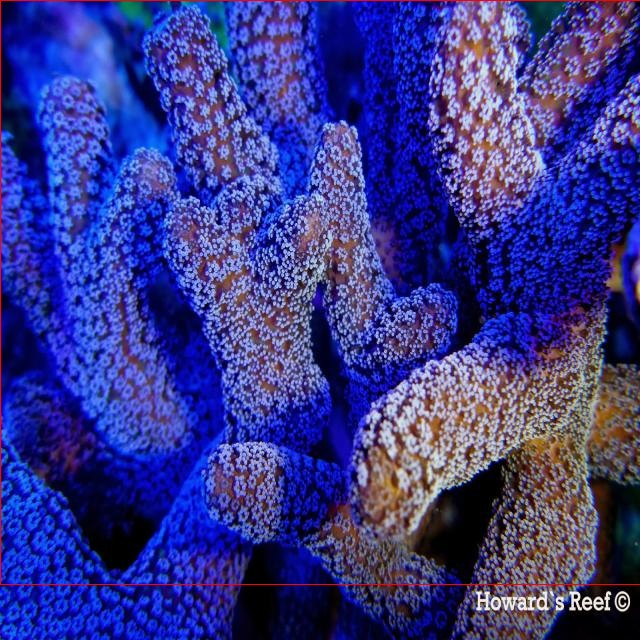

# 珊瑚物种检测系统源码分享
 # [一条龙教学YOLOV8标注好的数据集一键训练_70+全套改进创新点发刊_Web前端展示]

### 1.研究背景与意义

项目参考[AAAI Association for the Advancement of Artificial Intelligence](https://gitee.com/qunmasj/projects)

项目来源[AACV Association for the Advancement of Computer Vision](https://kdocs.cn/l/cszuIiCKVNis)

研究背景与意义

珊瑚礁生态系统是全球海洋生态的重要组成部分，承载着丰富的生物多样性和生态功能。然而，近年来，由于气候变化、海洋酸化、污染以及人类活动的影响，珊瑚礁正面临着前所未有的威胁。根据联合国环境规划署的报告，全球约有50%的珊瑚礁处于衰退状态，这不仅影响了珊瑚本身的生存，也对依赖这些生态系统的海洋生物及人类社会的可持续发展产生了深远的影响。因此，开展珊瑚物种的监测与保护工作显得尤为重要。

在这一背景下，计算机视觉技术的迅猛发展为珊瑚物种的检测与识别提供了新的可能性。YOLO（You Only Look Once）系列模型因其高效的实时目标检测能力而广泛应用于各类物体识别任务。YOLOv8作为该系列的最新版本，结合了深度学习的先进技术，具备更高的准确性和更快的处理速度。然而，针对特定生态环境中的物种检测，尤其是珊瑚物种的检测，仍然存在诸多挑战，如物种间的相似性、环境光照变化、遮挡等问题。因此，基于改进YOLOv8的珊瑚物种检测系统的研究具有重要的现实意义。

本研究旨在构建一个高效、准确的珊瑚物种检测系统，利用3500张图像和18个珊瑚物种类别的数据集，进行深度学习模型的训练与优化。数据集中涵盖了多种珊瑚物种，包括Acanthastrea、Acropora、Euphyllia等，这些物种在生态系统中扮演着不同的角色。通过对这些物种的准确识别与分类，可以为生态学研究提供重要的数据支持，帮助科学家们更好地理解珊瑚礁生态系统的动态变化。

此外，改进YOLOv8模型的研究不仅能够提升珊瑚物种检测的准确性，还可以为其他领域的目标检测任务提供借鉴。例如，在农业、野生动物保护等领域，基于深度学习的目标检测技术同样面临着物种识别的挑战。通过本研究的成功实施，相关技术的推广与应用将有助于提升生态监测的效率和准确性，推动生态保护工作的科学化和智能化。

综上所述，基于改进YOLOv8的珊瑚物种检测系统的研究，不仅具有重要的学术价值，还有助于推动珊瑚礁生态保护的实践应用。通过高效的检测系统，能够及时发现珊瑚物种的变化，为生态保护政策的制定提供科学依据，从而为全球海洋生态的可持续发展贡献力量。

### 2.图片演示


##### 注意：由于此博客编辑较早，上面“2.图片演示”和“3.视频演示”展示的系统图片或者视频可能为老版本，新版本在老版本的基础上升级如下：（实际效果以升级的新版本为准）

  （1）适配了YOLOV8的“目标检测”模型和“实例分割”模型，通过加载相应的权重（.pt）文件即可自适应加载模型。

  （2）支持“图片识别”、“视频识别”、“摄像头实时识别”三种识别模式。

  （3）支持“图片识别”、“视频识别”、“摄像头实时识别”三种识别结果保存导出，解决手动导出（容易卡顿出现爆内存）存在的问题，识别完自动保存结果并导出到tempDir中。

  （4）支持Web前端系统中的标题、背景图等自定义修改，后面提供修改教程。

  另外本项目提供训练的数据集和训练教程,暂不提供权重文件（best.pt）,需要您按照教程进行训练后实现图片演示和Web前端界面演示的效果。

### 3.视频演示

[3.1 视频演示](https://www.bilibili.com/video/BV1Ed2uYJE2E/)

### 4.数据集信息展示

##### 4.1 本项目数据集详细数据（类别数＆类别名）

nc: 18
names: ['Acanthastrea', 'Acropora', 'Coeloseris', 'Euphyllia', 'Favia', 'Favites', 'Goniastrea', 'Heterocyathus', 'Isopora', 'Leptoseris', 'Millepora', 'Pachyseris', 'Pocillopora', 'Porites', 'Psammocora', 'Sandalolitha', 'Stylophora', 'Trachyphilia']


##### 4.2 本项目数据集信息介绍

数据集信息展示

在现代生态保护与生物多样性研究中，珊瑚礁的健康状况与其物种的多样性密切相关。为了提升珊瑚物种的检测精度，研究团队构建了一个名为“Coral_Detection”的数据集，旨在为改进YOLOv8的珊瑚物种检测系统提供强有力的支持。该数据集包含18个不同的珊瑚物种类别，涵盖了广泛的珊瑚种类，以便于对其进行深入的研究和分析。

“Coral_Detection”数据集的类别数量为18，具体的类别列表包括：Acanthastrea、Acropora、Coeloseris、Euphyllia、Favia、Favites、Goniastrea、Heterocyathus、Isopora、Leptoseris、Millepora、Pachyseris、Pocillopora、Porites、Psammocora、Sandalolitha、Stylophora以及Trachyphilia。这些物种在生态系统中扮演着重要的角色，且各自具有独特的形态特征和生态习性。通过对这些物种的准确识别和分类，研究人员能够更好地监测珊瑚礁的健康状况，并采取相应的保护措施。

数据集的构建过程注重数据的多样性和代表性，确保每个物种的样本数量足够，以便于训练深度学习模型。数据集中包含的图像均为高质量的海洋摄影作品，捕捉了珊瑚在自然栖息环境中的真实状态。这些图像不仅展示了珊瑚的形态特征，还考虑了不同光照条件和水下环境对珊瑚外观的影响，力求在多变的海洋环境中提高模型的鲁棒性。

为了增强数据集的实用性，研究团队还对图像进行了标注，标注信息包括每个物种的边界框位置及其对应的类别标签。这种详细的标注方式使得“Coral_Detection”数据集不仅适用于物种检测任务，还能够为后续的物种识别和分类研究提供基础。通过对数据集的训练，YOLOv8模型能够学习到不同珊瑚物种的特征，从而在实际应用中实现快速而准确的检测。

此外，数据集的构建也考虑到了可扩展性和开放性，研究团队计划在未来持续更新和扩展数据集，增加更多的珊瑚物种及其变种，以适应不断变化的生态环境和研究需求。这种开放的态度不仅促进了学术界的合作与交流，也为其他研究者提供了丰富的资源，以便于他们在珊瑚生态研究和保护领域开展深入的探索。

总之，“Coral_Detection”数据集为改进YOLOv8的珊瑚物种检测系统提供了坚实的基础，凭借其丰富的类别信息和高质量的图像数据，必将推动珊瑚物种检测技术的发展，助力于全球范围内的珊瑚保护与生态恢复工作。通过这一数据集，研究人员能够更有效地识别和监测珊瑚物种，从而为保护海洋生态系统的健康做出贡献。





### 5.全套项目环境部署视频教程（零基础手把手教学）

[5.1 环境部署教程链接（零基础手把手教学）](https://www.ixigua.com/7404473917358506534?logTag=c807d0cbc21c0ef59de5)


[5.2 安装Python虚拟环境创建和依赖库安装视频教程链接（零基础手把手教学）](https://www.ixigua.com/7404474678003106304?logTag=1f1041108cd1f708b01a)

### 6.手把手YOLOV8训练视频教程（零基础小白有手就能学会）

[6.1 手把手YOLOV8训练视频教程（零基础小白有手就能学会）](https://www.ixigua.com/7404477157818401292?logTag=d31a2dfd1983c9668658)


按照上面的训练视频教程链接加载项目提供的数据集，运行train.py即可开始训练



     Epoch   gpu_mem       box       obj       cls    labels  img_size
     1/200     20.8G   0.01576   0.01955  0.007536        22      1280: 100%|██████████| 849/849 [14:42<00:00,  1.04s/it]
               Class     Images     Labels          P          R     mAP@.5 mAP@.5:.95: 100%|██████████| 213/213 [01:14<00:00,  2.87it/s]
                 all       3395      17314      0.994      0.957      0.0957      0.0843

     Epoch   gpu_mem       box       obj       cls    labels  img_size
     2/200     20.8G   0.01578   0.01923  0.007006        22      1280: 100%|██████████| 849/849 [14:44<00:00,  1.04s/it]
               Class     Images     Labels          P          R     mAP@.5 mAP@.5:.95: 100%|██████████| 213/213 [01:12<00:00,  2.95it/s]
                 all       3395      17314      0.996      0.956      0.0957      0.0845

     Epoch   gpu_mem       box       obj       cls    labels  img_size
     3/200     20.8G   0.01561    0.0191  0.006895        27      1280: 100%|██████████| 849/849 [10:56<00:00,  1.29it/s]
               Class     Images     Labels          P          R     mAP@.5 mAP@.5:.95: 100%|███████   | 187/213 [00:52<00:00,  4.04it/s]
                 all       3395      17314      0.996      0.957      0.0957      0.0845


### 7.70+种全套YOLOV8创新点代码加载调参视频教程（一键加载写好的改进模型的配置文件）

[7.1 70+种全套YOLOV8创新点代码加载调参视频教程（一键加载写好的改进模型的配置文件）](https://www.ixigua.com/7404478314661806627?logTag=29066f8288e3f4eea3a4)

### 8.70+种全套YOLOV8创新点原理讲解（非科班也可以轻松写刊发刊，V10版本正在科研待更新）

#### 由于篇幅限制，每个创新点的具体原理讲解就不一一展开，具体见下列网址中的创新点对应子项目的技术原理博客网址【Blog】：


[8.1 70+种全套YOLOV8创新点原理讲解链接](https://gitee.com/qunmasj/good)

#### 部分改进原理讲解(完整的改进原理见上图和技术博客链接)【如果此小节的图加载失败可以通过CSDN或者Github搜索该博客的标题访问原始博客，原始博客图片显示正常】
### YOLOv8简介

YOLOv8 是 Ultralytics 公司继 YOLOv5 算法之后开发的下一代算法模型，目前支持图像分类、物体检测和实例分割任务。YOLOv8 是一个 SOTA 模型，它建立在之前YOLO 系列模型的成功基础上，并引入了新的功能和改进，以进一步提升性能和灵活性。具体创新包括：一个新的骨干网络、一个新的 Ancher-Free 检测头和一个新的损失函数，可以在从 CPU 到 GPU 的各种硬件平台上运行。注意到ultralytics 并没有直接将开源库命名为 YOLOv8，而是直接使用 Ultralytics这个单词，原因是Ultralytics这个库的定位是算法框架，而非特指某一个特定算法，其希望这个库不仅仅能够用于 YOLO 系列模型，同时也能支持其他的视觉任务如图像分类、实例分割等。下图画图YOLOv8目标检测算法同其他YOLO系列算法（YOLOv5、6、7）的实验对比图，左边是模型参数量对比，右边是速度对比。


下面两个表分别是YOLOv8和YOLOv5（v7.0版本）官方在 COCO Val 2017 数据集上测试结果，从中看出 YOLOv8 相比 YOLOv5 精度提升大，但是 N/S/M 模型相应的参数量、FLOPS等提高了不少。


#### YOLOv8概述
提供了一个全新的SOTA模型，和YOLOv5一样，基于缩放系数也提供了 N/S/M/L/X 尺度的不同大小模型，用于满足不同场景需求，同时支持图像分类、目标检测、实例分割和姿态检测任务
在骨干网络和Neck部分将YOLOv5的C3结构换成了梯度流更丰富的 C2f 结构，并对不同尺度模型调整了不同的通道数，大幅提升了模型性能；需要注意的是C2f 模块中存在Split等操作对特定硬件部署没有之前那么友好


Head部分换成了目前主流的解耦头结构，将分类和检测头分离，同时也从 Anchor-Based换成了Anchor-Free Loss
计算方面采用了 TaskAlignedAssigner 正样本分配策略，并引入了 Distribution Focal Loss
下图画出YOLOv8目标检测算法的整体结构图


#### YOLOv8模型
YOLOv8目标检测算法的模型配置文件如下：


从配置文件可以看出，YOLOv8与YOLOv5模型最明显的差异是使用C2F模块替换了原来的C3模块，两个模块的结构图下图所示。


另外Head 部分变化最大，从原先的耦合头变成了解耦头，并且从 YOLOv5 的 Anchor-Based 变成了 Anchor-Free。其结构对比图如下所示：

### RepViT简介

近年来，与轻量级卷积神经网络(cnn)相比，轻量级视觉变压器(ViTs)在资源受限的移动设备上表现出了更高的性能和更低的延迟。这种改进通常归功于多头自注意模块，它使模型能够学习全局表示。然而，轻量级vit和轻量级cnn之间的架构差异还没有得到充分的研究。在这项研究中，我们重新审视了轻量级cnn的高效设计，并强调了它们在移动设备上的潜力。通过集成轻量级vit的高效架构选择，我们逐步增强了标准轻量级CNN的移动友好性，特别是MobileNetV3。这就产生了一个新的纯轻量级cnn家族，即RepViT。大量的实验表明，RepViT优于现有的轻型vit，并在各种视觉任务中表现出良好的延迟。在ImageNet上，RepViT在iPhone 12上以近1ms的延迟实现了超过80%的top-1精度，据我们所知，这是轻量级模型的第一次。

#### RepViT简介
轻量级模型研究一直是计算机视觉任务中的一个焦点，其目标是在降低计算成本的同时达到优秀的性能。轻量级模型与资源受限的移动设备尤其相关，使得视觉模型的边缘部署成为可能。在过去十年中，研究人员主要关注轻量级卷积神经网络（CNNs）的设计，提出了许多高效的设计原则，包括可分离卷积 、逆瓶颈结构 、通道打乱 和结构重参数化等，产生了 MobileNets ，ShuffleNets和 RepVGG 等代表性模型。

另一方面，视觉 Transformers（ViTs）成为学习视觉表征的另一种高效方案。与 CNNs 相比，ViTs 在各种计算机视觉任务中表现出了更优越的性能。然而，ViT 模型一般尺寸很大，延迟很高，不适合资源受限的移动设备。因此，研究人员开始探索 ViT 的轻量级设计。许多高效的ViTs设计原则被提出，大大提高了移动设备上 ViTs 的计算效率，产生了EfficientFormers ，MobileViTs等代表性模型。这些轻量级 ViTs 在移动设备上展现出了相比 CNNs 的更强的性能和更低的延迟。

轻量级 ViTs 优于轻量级 CNNs 的原因通常归结于多头注意力模块，该模块使模型能够学习全局表征。然而，轻量级 ViTs 和轻量级 CNNs 在块结构、宏观和微观架构设计方面存在值得注意的差异，但这些差异尚未得到充分研究。这自然引出了一个问题：轻量级 ViTs 的架构选择能否提高轻量级 CNN 的性能？在这项工作中，我们结合轻量级 ViTs 的架构选择，重新审视了轻量级 CNNs 的设计。我们的旨在缩小轻量级 CNNs 与轻量级 ViTs 之间的差距，并强调前者与后者相比在移动设备上的应用潜力。


在 ConvNeXt 中，参考该博客提出的基于 ResNet50 架构的基础上通过严谨的理论和实验分析，最终设计出一个非常优异的足以媲美 Swin-Transformer 的纯卷积神经网络架构。同样地，RepViT也是主要通过将轻量级 ViTs 的架构设计逐步整合到标准轻量级 CNN，即MobileNetV3-L，来对其进行针对性地改造（魔改）。在这个过程中，作者们考虑了不同粒度级别的设计元素，并通过一系列步骤达到优化的目标。


详细优化步骤如下：

#### 训练配方的对齐
论文中引入了一种衡量移动设备上延迟的指标，并将训练策略与现有的轻量级 ViTs 对齐。这一步骤主要是为了确保模型训练的一致性，其涉及两个概念，即延迟度量和训练策略的调整。

#### 延迟度量指标
为了更准确地衡量模型在真实移动设备上的性能，作者选择了直接测量模型在设备上的实际延迟，以此作为基准度量。这个度量方法不同于之前的研究，它们主要通过FLOPs或模型大小等指标优化模型的推理速度，这些指标并不总能很好地反映在移动应用中的实际延迟。

#### 训练策略的对齐
这里，将 MobileNetV3-L 的训练策略调整以与其他轻量级 ViTs 模型对齐。这包括使用 AdamW 优化器-ViTs 模型必备的优化器，进行 5 个 epoch 的预热训练，以及使用余弦退火学习率调度进行 300 个 epoch 的训练。尽管这种调整导致了模型准确率的略微下降，但可以保证公平性。

#### 块设计的优化
基于一致的训练设置，作者们探索了最优的块设计。块设计是 CNN 架构中的一个重要组成部分，优化块设计有助于提高网络的性能。

#### 分离 Token 混合器和通道混合器
这块主要是对 MobileNetV3-L 的块结构进行了改进，分离了令牌混合器和通道混合器。原来的 MobileNetV3 块结构包含一个 1x1 扩张卷积，然后是一个深度卷积和一个 1x1 的投影层，然后通过残差连接连接输入和输出。在此基础上，RepViT 将深度卷积提前，使得通道混合器和令牌混合器能够被分开。为了提高性能，还引入了结构重参数化来在训练时为深度滤波器引入多分支拓扑。最终，作者们成功地在 MobileNetV3 块中分离了令牌混合器和通道混合器，并将这种块命名为 RepViT 块。

#### 降低扩张比例并增加宽度
在通道混合器中，原本的扩张比例是 4，这意味着 MLP 块的隐藏维度是输入维度的四倍，消耗了大量的计算资源，对推理时间有很大的影响。为了缓解这个问题，我们可以将扩张比例降低到 2，从而减少了参数冗余和延迟，使得 MobileNetV3-L 的延迟降低到 0.65ms。随后，通过增加网络的宽度，即增加各阶段的通道数量，Top-1 准确率提高到 73.5%，而延迟只增加到 0.89ms！

#### 宏观架构元素的优化
在这一步，本文进一步优化了MobileNetV3-L在移动设备上的性能，主要是从宏观架构元素出发，包括 stem，降采样层，分类器以及整体阶段比例。通过优化这些宏观架构元素，模型的性能可以得到显著提高。

#### 浅层网络使用卷积提取器
ViTs 通常使用一个将输入图像分割成非重叠补丁的 “patchify” 操作作为 stem。然而，这种方法在训练优化性和对训练配方的敏感性上存在问题。因此，作者们采用了早期卷积来代替，这种方法已经被许多轻量级 ViTs 所采纳。对比之下，MobileNetV3-L 使用了一个更复杂的 stem 进行 4x 下采样。这样一来，虽然滤波器的初始数量增加到24，但总的延迟降低到0.86ms，同时 top-1 准确率提高到 73.9%。

#### 更深的下采样层
在 ViTs 中，空间下采样通常通过一个单独的补丁合并层来实现。因此这里我们可以采用一个单独和更深的下采样层，以增加网络深度并减少由于分辨率降低带来的信息损失。具体地，作者们首先使用一个 1x1 卷积来调整通道维度，然后将两个 1x1 卷积的输入和输出通过残差连接，形成一个前馈网络。此外，他们还在前面增加了一个 RepViT 块以进一步加深下采样层，这一步提高了 top-1 准确率到 75.4%，同时延迟为 0.96ms。

#### 更简单的分类器
在轻量级 ViTs 中，分类器通常由一个全局平均池化层后跟一个线性层组成。相比之下，MobileNetV3-L 使用了一个更复杂的分类器。因为现在最后的阶段有更多的通道，所以作者们将它替换为一个简单的分类器，即一个全局平均池化层和一个线性层，这一步将延迟降低到 0.77ms，同时 top-1 准确率为 74.8%。

#### 整体阶段比例
阶段比例代表了不同阶段中块数量的比例，从而表示了计算在各阶段中的分布。论文选择了一个更优的阶段比例 1:1:7:1，然后增加网络深度到 2:2:14:2，从而实现了一个更深的布局。这一步将 top-1 准确率提高到 76.9%，同时延迟为 1.02 ms。

#### 卷积核大小的选择
众所周知，CNNs 的性能和延迟通常受到卷积核大小的影响。例如，为了建模像 MHSA 这样的远距离上下文依赖，ConvNeXt 使用了大卷积核，从而实现了显著的性能提升。然而，大卷积核对于移动设备并不友好，因为它的计算复杂性和内存访问成本。MobileNetV3-L 主要使用 3x3 的卷积，有一部分块中使用 5x5 的卷积。作者们将它们替换为3x3的卷积，这导致延迟降低到 1.00ms，同时保持了76.9%的top-1准确率。

#### SE 层的位置
自注意力模块相对于卷积的一个优点是根据输入调整权重的能力，这被称为数据驱动属性。作为一个通道注意力模块，SE层可以弥补卷积在缺乏数据驱动属性上的限制，从而带来更好的性能。MobileNetV3-L 在某些块中加入了SE层，主要集中在后两个阶段。然而，与分辨率较高的阶段相比，分辨率较低的阶段从SE提供的全局平均池化操作中获得的准确率提升较小。作者们设计了一种策略，在所有阶段以交叉块的方式使用SE层，从而在最小的延迟增量下最大化准确率的提升，这一步将top-1准确率提升到77.4%，同时延迟降低到0.87ms。

注意！【这一点其实百度在很早前就已经做过实验比对得到过这个结论了，SE 层放置在靠近深层的地方效果好】

#### 微观设计的调整
RepViT 通过逐层微观设计来调整轻量级 CNN，这包括选择合适的卷积核大小和优化挤压-激励（Squeeze-and-excitation，简称SE）层的位置。这两种方法都能显著改善模型性能。

#### 网络架构
最终，通过整合上述改进策略，我们便得到了模型RepViT的整体架构，该模型有多个变种，例如RepViT-M1/M2/M3。同样地，不同的变种主要通过每个阶段的通道数和块数来区分。


### 9.系统功能展示（检测对象为举例，实际内容以本项目数据集为准）

图9.1.系统支持检测结果表格显示

  图9.2.系统支持置信度和IOU阈值手动调节

  图9.3.系统支持自定义加载权重文件best.pt(需要你通过步骤5中训练获得)

  图9.4.系统支持摄像头实时识别

  图9.5.系统支持图片识别

  图9.6.系统支持视频识别

  图9.7.系统支持识别结果文件自动保存

  图9.8.系统支持Excel导出检测结果数据


### 10.原始YOLOV8算法原理

原始YOLOv8算法原理

YOLO（You Only Look Once）系列算法自2015年首次提出以来，已经历经多个版本的迭代，每一次更新都在目标检测领域引入了新的思路和技术。YOLOv8作为该系列的最新版本，承载着前几代算法的精华，并在此基础上进行了显著的改进和创新。其核心思想依然是将目标检测任务转化为一个回归问题，通过一个单一的神经网络模型同时预测目标的位置和类别。然而，YOLOv8在训练效率、检测精度以及模型轻量化等方面的提升，使其在实时检测应用中表现得尤为出色。

YOLOv8的网络结构主要由三个部分组成：主干网络（Backbone）、特征增强网络（Neck）和检测头（Head）。在主干网络方面，YOLOv8延续了YOLOv5中引入的CSP（Cross Stage Partial）结构，采用了C2f模块来替代YOLOv5中的C3模块。这一变化不仅保持了模型的轻量化特性，还在不牺牲检测精度的前提下，进一步增强了特征提取的能力。C2f模块通过引入ELAN（Efficient Layer Aggregation Network）思想，优化了梯度流动，确保了在深层网络中能够有效提取到更多的特征信息。

特征增强网络部分，YOLOv8采用了PAN-FPN（Path Aggregation Network - Feature Pyramid Network）结构。这一结构的设计使得不同层次的特征能够进行有效的融合，确保了在多尺度目标检测时，模型能够充分利用浅层、中层和高层特征的信息。通过自下而上的特征融合，YOLOv8能够更好地捕捉到目标的细节信息，同时通过自上而下的融合，增强了高层特征的语义信息，从而提升了检测的准确性。

在检测头部分，YOLOv8引入了解耦头的设计，将目标分类和边框回归任务分开处理。这一设计的核心在于，通过解耦，使得每个任务能够更加专注于自身的目标，从而有效地解决了复杂场景下定位不准和分类错误的问题。YOLOv8的检测头输出三个不同尺度的特征图，分别对应于80x80、40x40和20x20的分辨率。这种多尺度的输出设计，使得模型能够在不同大小的目标上都能保持良好的检测性能。

YOLOv8的另一大创新在于其采用了Anchor-free的目标检测方法。传统的YOLO系列模型通常依赖于预定义的锚点框来预测目标的位置，这种方法在处理不同尺度和形状的目标时，往往需要复杂的锚点选择和调整。而YOLOv8通过回归的方式，直接预测目标的位置和大小，极大地简化了模型的设计，同时也提高了模型的推理速度和准确性。网络能够更快地聚焦到目标位置的邻近点，使得预测框更接近于实际的边界框区域，从而提高了检测的精度。

在损失函数的设计上，YOLOv8采用了VFLLoss作为分类损失，并结合DFLLoss和CIoULoss作为回归损失。这种多损失函数的组合，旨在更好地平衡分类和回归任务之间的关系，进一步提升模型的学习效果。通过优化损失函数，YOLOv8能够在训练过程中更有效地处理样本不平衡的问题，尤其是在面对小目标和困难样本时，模型的表现更加稳定。

此外，YOLOv8在样本匹配策略上也进行了创新，将静态匹配改为Task-Aligned的Assigner匹配方式。这一变化使得模型在训练时能够更灵活地适应不同的目标检测任务，提高了模型的泛化能力和适应性。

在数据预处理方面，YOLOv8延续了YOLOv5的策略，采用了包括马赛克增强、混合增强、空间扰动和颜色扰动等多种数据增强手段。这些增强手段能够有效地提高模型的鲁棒性，使其在各种复杂环境下都能保持良好的检测性能。

总的来说，YOLOv8在多个方面的创新和改进，使其成为当前目标检测领域的一个重要里程碑。其高效的推理速度、优越的检测精度以及灵活的模型设计，使得YOLOv8在实际应用中展现出了广泛的适用性。无论是在智能监控、自动驾驶还是工业检测等领域，YOLOv8都能够为实时目标检测提供强有力的支持，推动着目标检测技术的不断发展和进步。


### 11.项目核心源码讲解（再也不用担心看不懂代码逻辑）

#### 11.1 code\ultralytics\models\yolo\classify\__init__.py

以下是对给定代码的逐行分析和核心部分的保留，以及详细的中文注释：

```python
# Ultralytics YOLO 🚀, AGPL-3.0 license

# 从 ultralytics.models.yolo.classify 模块导入 ClassificationPredictor 类
from ultralytics.models.yolo.classify.predict import ClassificationPredictor

# 从 ultralytics.models.yolo.classify 模块导入 ClassificationTrainer 类
from ultralytics.models.yolo.classify.train import ClassificationTrainer

# 从 ultralytics.models.yolo.classify 模块导入 ClassificationValidator 类
from ultralytics.models.yolo.classify.val import ClassificationValidator

# 定义模块的公开接口，包含三个类
__all__ = "ClassificationPredictor", "ClassificationTrainer", "ClassificationValidator"
```

### 核心部分分析：
1. **导入类**：
   - `ClassificationPredictor`：用于进行分类预测的类。
   - `ClassificationTrainer`：用于训练分类模型的类。
   - `ClassificationValidator`：用于验证分类模型性能的类。

2. **模块公开接口**：
   - `__all__`：定义了当使用 `from module import *` 时，哪些类会被导入。这里包含了三个核心类，表明它们是该模块的主要功能。

### 详细注释：
- 该代码是 Ultralytics YOLO 项目的一部分，主要用于目标检测和分类任务。
- 通过导入相关的类，用户可以方便地进行模型的训练、预测和验证。
- `__all__` 的定义有助于控制模块的导出内容，确保用户只访问到模块的核心功能。

通过以上分析和注释，可以看出该代码的核心在于提供了分类模型的训练、预测和验证功能。

这个文件是Ultralytics YOLO项目中的一个初始化文件，位于`code/ultralytics/models/yolo/classify/`目录下。文件的主要功能是导入与分类相关的模块，并定义了一个公共接口。

首先，文件的开头包含了一条注释，说明这是Ultralytics YOLO项目的一部分，并且使用的是AGPL-3.0许可证。这意味着该项目是开源的，用户可以自由使用和修改，但需要遵循相应的许可证条款。

接下来，文件通过`from`语句导入了三个重要的类：`ClassificationPredictor`、`ClassificationTrainer`和`ClassificationValidator`。这些类分别负责分类任务中的预测、训练和验证功能。具体来说：

- `ClassificationPredictor`类用于进行分类预测，可能会处理输入数据并返回分类结果。
- `ClassificationTrainer`类负责模型的训练过程，包括数据加载、模型优化等。
- `ClassificationValidator`类用于验证训练好的模型的性能，通常会评估模型在验证集上的表现。

最后，`__all__`变量被定义为一个元组，包含了这三个类的名称。这意味着当使用`from module import *`语句导入这个模块时，只会导入这三个类，从而控制了模块的公共接口，避免不必要的名称污染。

总的来说，这个文件的作用是组织和暴露与YOLO分类相关的功能模块，为其他部分的代码提供了一个清晰的接口。

#### 11.2 ui.py

以下是代码中最核心的部分，并附上详细的中文注释：

```python
import sys
import subprocess

def run_script(script_path):
    """
    使用当前 Python 环境运行指定的脚本。

    Args:
        script_path (str): 要运行的脚本路径

    Returns:
        None
    """
    # 获取当前 Python 解释器的路径
    python_path = sys.executable

    # 构建运行命令，使用 streamlit 运行指定的脚本
    command = f'"{python_path}" -m streamlit run "{script_path}"'

    # 执行命令
    result = subprocess.run(command, shell=True)
    # 检查命令执行的返回码，如果不为0则表示出错
    if result.returncode != 0:
        print("脚本运行出错。")

# 实例化并运行应用
if __name__ == "__main__":
    # 指定要运行的脚本路径
    script_path = "web.py"  # 这里可以直接指定脚本名，假设在当前目录下

    # 调用函数运行脚本
    run_script(script_path)
```

### 代码注释说明：
1. **导入模块**：
   - `sys`：用于访问与 Python 解释器相关的变量和函数。
   - `subprocess`：用于执行外部命令和程序。

2. **定义 `run_script` 函数**：
   - 此函数接受一个参数 `script_path`，表示要运行的 Python 脚本的路径。
   - 使用 `sys.executable` 获取当前 Python 解释器的路径，以确保使用正确的 Python 环境来运行脚本。
   - 构建一个命令字符串，使用 `streamlit` 模块来运行指定的脚本。
   - 使用 `subprocess.run` 执行构建的命令，并检查返回码以确定脚本是否成功运行。

3. **主程序入口**：
   - 在 `if __name__ == "__main__":` 块中，指定要运行的脚本路径（在此示例中为 `web.py`）。
   - 调用 `run_script` 函数来执行指定的脚本。

这个程序文件名为 `ui.py`，其主要功能是使用当前的 Python 环境来运行一个指定的脚本，具体是通过 Streamlit 框架来启动一个 Web 应用。

程序首先导入了必要的模块，包括 `sys`、`os` 和 `subprocess`，这些模块分别用于获取系统信息、操作文件路径和执行外部命令。此外，还从 `QtFusion.path` 导入了 `abs_path` 函数，用于获取脚本的绝对路径。

在 `run_script` 函数中，首先定义了一个参数 `script_path`，用于接收要运行的脚本的路径。函数内部通过 `sys.executable` 获取当前 Python 解释器的路径，然后构建一个命令字符串，命令的格式是使用 Streamlit 来运行指定的脚本。接着，使用 `subprocess.run` 方法执行这个命令，并通过 `shell=True` 参数允许在 shell 中执行命令。

如果命令执行后返回的状态码不为 0，表示脚本运行出错，程序会打印出错误信息。

在文件的最后部分，使用 `if __name__ == "__main__":` 来判断当前模块是否是主程序。如果是主程序，则指定要运行的脚本路径为 `web.py` 的绝对路径，并调用 `run_script` 函数来执行这个脚本。

总体来说，这个程序的核心功能是通过命令行启动一个 Streamlit 应用，方便用户在浏览器中访问和使用。

#### 11.3 70+种YOLOv8算法改进源码大全和调试加载训练教程（非必要）\ultralytics\models\yolo\detect\__init__.py

```python
# Ultralytics YOLO 🚀, AGPL-3.0 license

# 从当前模块导入三个类：DetectionPredictor、DetectionTrainer 和 DetectionValidator
from .predict import DetectionPredictor  # 导入用于目标检测预测的类
from .train import DetectionTrainer      # 导入用于目标检测训练的类
from .val import DetectionValidator       # 导入用于目标检测验证的类

# 定义模块的公开接口，指定可以被外部访问的类
__all__ = 'DetectionPredictor', 'DetectionTrainer', 'DetectionValidator'
```

### 代码注释说明：
1. **导入模块**：
   - `from .predict import DetectionPredictor`：从当前包的 `predict` 模块中导入 `DetectionPredictor` 类，该类通常用于进行目标检测的预测。
   - `from .train import DetectionTrainer`：从当前包的 `train` 模块中导入 `DetectionTrainer` 类，该类用于训练目标检测模型。
   - `from .val import DetectionValidator`：从当前包的 `val` 模块中导入 `DetectionValidator` 类，该类用于验证目标检测模型的性能。

2. **公开接口**：
   - `__all__` 变量定义了当前模块中可以被外部访问的类或函数。当使用 `from module import *` 语句时，只有在 `__all__` 中列出的名称会被导入。这有助于控制模块的公共 API，避免不必要的名称暴露。

这个程序文件是Ultralytics YOLO（You Only Look Once）算法的一部分，主要用于目标检测任务。文件的功能主要是导入和组织与检测相关的类和功能模块。

首先，文件开头的注释部分提到这是Ultralytics YOLO的代码，并且使用了AGPL-3.0许可证，这意味着该代码是开源的，用户可以自由使用和修改，但需要遵循相应的许可证条款。

接下来，文件通过相对导入的方式引入了三个重要的类：`DetectionPredictor`、`DetectionTrainer`和`DetectionValidator`。这些类分别负责不同的功能。`DetectionPredictor`用于进行目标检测的预测，`DetectionTrainer`用于训练模型，而`DetectionValidator`则用于验证模型的性能。

最后，`__all__`变量定义了当使用`from module import *`语句时，哪些名称会被导入。这里指定了三个类，使得用户在导入时能够方便地使用这些核心功能。

总的来说，这个文件是YOLOv8目标检测框架的一个模块，负责整合和提供检测相关的功能，便于后续的使用和扩展。

#### 11.4 70+种YOLOv8算法改进源码大全和调试加载训练教程（非必要）\ultralytics\nn\extra_modules\RFAConv.py

以下是代码中最核心的部分，并附上详细的中文注释：

```python
import torch
import torch.nn as nn
from einops import rearrange

class RFAConv(nn.Module):
    def __init__(self, in_channel, out_channel, kernel_size, stride=1):
        super().__init__()
        self.kernel_size = kernel_size

        # 通过平均池化和卷积生成权重
        self.get_weight = nn.Sequential(
            nn.AvgPool2d(kernel_size=kernel_size, padding=kernel_size // 2, stride=stride),
            nn.Conv2d(in_channel, in_channel * (kernel_size ** 2), kernel_size=1, groups=in_channel, bias=False)
        )
        
        # 生成特征的卷积层
        self.generate_feature = nn.Sequential(
            nn.Conv2d(in_channel, in_channel * (kernel_size ** 2), kernel_size=kernel_size, padding=kernel_size // 2, stride=stride, groups=in_channel, bias=False),
            nn.BatchNorm2d(in_channel * (kernel_size ** 2)),
            nn.ReLU()
        )
        
        # 最终的卷积层
        self.conv = nn.Conv2d(in_channel, out_channel, kernel_size=kernel_size, stride=kernel_size)

    def forward(self, x):
        b, c = x.shape[0:2]  # 获取输入的批次大小和通道数
        weight = self.get_weight(x)  # 计算权重
        h, w = weight.shape[2:]  # 获取特征图的高和宽
        
        # 对权重进行softmax归一化
        weighted = weight.view(b, c, self.kernel_size ** 2, h, w).softmax(2)  # b c*kernel**2, h, w
        
        # 生成特征并调整形状
        feature = self.generate_feature(x).view(b, c, self.kernel_size ** 2, h, w)  # b c*kernel**2, h, w
        
        # 加权特征
        weighted_data = feature * weighted
        
        # 调整形状以便进行卷积
        conv_data = rearrange(weighted_data, 'b c (n1 n2) h w -> b c (h n1) (w n2)', n1=self.kernel_size, n2=self.kernel_size)
        
        return self.conv(conv_data)  # 返回卷积结果

class SE(nn.Module):
    def __init__(self, in_channel, ratio=16):
        super(SE, self).__init__()
        self.gap = nn.AdaptiveAvgPool2d((1, 1))  # 全局平均池化
        self.fc = nn.Sequential(
            nn.Linear(in_channel, ratio, bias=False),  # 从 c -> c/r
            nn.ReLU(),
            nn.Linear(ratio, in_channel, bias=False),  # 从 c/r -> c
            nn.Sigmoid()
        )

    def forward(self, x):
        b, c = x.shape[0:2]  # 获取输入的批次大小和通道数
        y = self.gap(x).view(b, c)  # 进行全局平均池化并调整形状
        y = self.fc(y).view(b, c, 1, 1)  # 通过全连接层并调整形状
        return y  # 返回通道注意力权重

class RFCBAMConv(nn.Module):
    def __init__(self, in_channel, out_channel, kernel_size=3, stride=1):
        super().__init__()
        self.kernel_size = kernel_size
        
        # 生成特征的卷积层
        self.generate = nn.Sequential(
            nn.Conv2d(in_channel, in_channel * (kernel_size ** 2), kernel_size, padding=kernel_size // 2, stride=stride, groups=in_channel, bias=False),
            nn.BatchNorm2d(in_channel * (kernel_size ** 2)),
            nn.ReLU()
        )
        
        # 计算权重的卷积层
        self.get_weight = nn.Sequential(nn.Conv2d(2, 1, kernel_size=3, padding=1, bias=False), nn.Sigmoid())
        self.se = SE(in_channel)  # 通道注意力模块

        # 最终的卷积层
        self.conv = nn.Conv2d(in_channel, out_channel, kernel_size=kernel_size, stride=kernel_size)

    def forward(self, x):
        b, c = x.shape[0:2]  # 获取输入的批次大小和通道数
        channel_attention = self.se(x)  # 计算通道注意力
        generate_feature = self.generate(x)  # 生成特征

        h, w = generate_feature.shape[2:]  # 获取特征图的高和宽
        generate_feature = generate_feature.view(b, c, self.kernel_size ** 2, h, w)  # 调整形状
        
        # 调整形状以便进行卷积
        generate_feature = rearrange(generate_feature, 'b c (n1 n2) h w -> b c (h n1) (w n2)', n1=self.kernel_size, n2=self.kernel_size)
        
        # 加权特征
        unfold_feature = generate_feature * channel_attention
        
        # 计算最大特征和平均特征
        max_feature, _ = torch.max(generate_feature, dim=1, keepdim=True)
        mean_feature = torch.mean(generate_feature, dim=1, keepdim=True)
        
        # 计算感受野注意力
        receptive_field_attention = self.get_weight(torch.cat((max_feature, mean_feature), dim=1))
        
        # 返回卷积结果
        conv_data = unfold_feature * receptive_field_attention
        return self.conv(conv_data)
```

### 代码说明：
1. **RFAConv**：实现了一种基于卷积的特征加权机制。通过平均池化和卷积生成权重，然后对输入特征进行加权，最后通过卷积层输出结果。
2. **SE**：实现了通道注意力机制，使用全局平均池化和全连接层来生成通道权重，增强重要特征。
3. **RFCBAMConv**：结合了特征生成和通道注意力机制，使用最大池化和平均池化来计算感受野注意力，并将其应用于生成的特征，最后通过卷积层输出结果。

这个程序文件包含了多个深度学习模块的实现，主要用于构建改进的卷积神经网络，特别是在YOLOv8算法中使用的模块。文件中定义了几个类，包括`h_sigmoid`、`h_swish`、`RFAConv`、`RFCBAMConv`和`RFCAConv`，每个类都有其特定的功能和结构。

首先，`h_sigmoid`和`h_swish`是激活函数的实现。`h_sigmoid`是一个带有ReLU6的激活函数，输出范围被限制在0到1之间。`h_swish`则结合了`h_sigmoid`和输入值，形成了一个新的激活函数，适用于深度学习模型中。

接下来是`RFAConv`类，它实现了一种改进的卷积操作。该类的构造函数中定义了几个子模块，包括用于生成权重的平均池化和卷积层，以及用于生成特征的卷积层和激活函数。`forward`方法中，输入数据经过这些子模块处理后，生成的特征与权重相乘，并通过重排操作后输入到最终的卷积层中，得到输出。

`RFCBAMConv`类则在`RFAConv`的基础上增加了通道注意力机制。它使用了一个SE（Squeeze-and-Excitation）模块来计算通道注意力，并结合最大池化和平均池化的特征生成权重。通过这种方式，模型能够更好地关注重要的特征，提高性能。

最后，`RFCAConv`类进一步扩展了功能，结合了空间注意力机制。它在生成特征后，通过自适应平均池化计算特征的高度和宽度，并将这些信息结合起来，生成空间注意力权重。最终，这些权重与生成的特征相乘，得到的结果再通过卷积层输出。

整体来看，这个文件实现了多种卷积模块，结合了不同的注意力机制和激活函数，旨在提高卷积神经网络的表达能力和性能，适用于YOLOv8等目标检测任务。

#### 11.5 train.py

以下是经过简化并添加详细中文注释的核心代码部分：

```python
import random
import numpy as np
import torch.nn as nn
from ultralytics.data import build_dataloader, build_yolo_dataset
from ultralytics.engine.trainer import BaseTrainer
from ultralytics.models import yolo
from ultralytics.nn.tasks import DetectionModel
from ultralytics.utils import LOGGER, RANK
from ultralytics.utils.torch_utils import de_parallel, torch_distributed_zero_first

class DetectionTrainer(BaseTrainer):
    """
    扩展自 BaseTrainer 类的检测模型训练类。
    """

    def build_dataset(self, img_path, mode="train", batch=None):
        """
        构建 YOLO 数据集。

        参数:
            img_path (str): 包含图像的文件夹路径。
            mode (str): 模式，`train` 或 `val`，用户可以为每种模式自定义不同的数据增强。
            batch (int, optional): 批次大小，适用于 `rect` 模式。默认为 None。
        """
        gs = max(int(de_parallel(self.model).stride.max() if self.model else 0), 32)
        return build_yolo_dataset(self.args, img_path, batch, self.data, mode=mode, rect=mode == "val", stride=gs)

    def get_dataloader(self, dataset_path, batch_size=16, rank=0, mode="train"):
        """构造并返回数据加载器。"""
        assert mode in ["train", "val"]
        with torch_distributed_zero_first(rank):  # 在 DDP 中仅初始化数据集 *.cache 一次
            dataset = self.build_dataset(dataset_path, mode, batch_size)
        shuffle = mode == "train"  # 训练模式下打乱数据
        if getattr(dataset, "rect", False) and shuffle:
            LOGGER.warning("WARNING ⚠️ 'rect=True' 与 DataLoader shuffle 不兼容，设置 shuffle=False")
            shuffle = False
        workers = self.args.workers if mode == "train" else self.args.workers * 2
        return build_dataloader(dataset, batch_size, workers, shuffle, rank)  # 返回数据加载器

    def preprocess_batch(self, batch):
        """对一批图像进行预处理，包括缩放和转换为浮点数。"""
        batch["img"] = batch["img"].to(self.device, non_blocking=True).float() / 255  # 将图像转换为浮点数并归一化
        if self.args.multi_scale:  # 如果启用多尺度
            imgs = batch["img"]
            sz = (
                random.randrange(self.args.imgsz * 0.5, self.args.imgsz * 1.5 + self.stride)
                // self.stride
                * self.stride
            )  # 随机选择图像大小
            sf = sz / max(imgs.shape[2:])  # 计算缩放因子
            if sf != 1:
                ns = [
                    math.ceil(x * sf / self.stride) * self.stride for x in imgs.shape[2:]
                ]  # 计算新的形状
                imgs = nn.functional.interpolate(imgs, size=ns, mode="bilinear", align_corners=False)  # 调整图像大小
            batch["img"] = imgs
        return batch

    def get_model(self, cfg=None, weights=None, verbose=True):
        """返回 YOLO 检测模型。"""
        model = DetectionModel(cfg, nc=self.data["nc"], verbose=verbose and RANK == -1)  # 创建检测模型
        if weights:
            model.load(weights)  # 加载权重
        return model

    def plot_training_samples(self, batch, ni):
        """绘制带有注释的训练样本。"""
        plot_images(
            images=batch["img"],
            batch_idx=batch["batch_idx"],
            cls=batch["cls"].squeeze(-1),
            bboxes=batch["bboxes"],
            paths=batch["im_file"],
            fname=self.save_dir / f"train_batch{ni}.jpg",
            on_plot=self.on_plot,
        )

    def plot_metrics(self):
        """从 CSV 文件绘制指标。"""
        plot_results(file=self.csv, on_plot=self.on_plot)  # 保存结果图像
```

### 代码说明：
1. **DetectionTrainer 类**：该类继承自 `BaseTrainer`，用于实现基于 YOLO 模型的目标检测训练。
2. **build_dataset 方法**：根据输入的图像路径和模式构建数据集，支持训练和验证模式。
3. **get_dataloader 方法**：构造数据加载器，支持多进程加载和数据打乱。
4. **preprocess_batch 方法**：对输入的图像批次进行预处理，包括归一化和可选的多尺度调整。
5. **get_model 方法**：返回一个 YOLO 检测模型，并可选择加载预训练权重。
6. **plot_training_samples 方法**：绘制训练样本及其对应的标签，便于可视化训练过程。
7. **plot_metrics 方法**：从 CSV 文件中读取并绘制训练指标，帮助分析模型性能。

这个程序文件 `train.py` 是一个用于训练 YOLO（You Only Look Once）目标检测模型的 Python 脚本，继承自 `BaseTrainer` 类。它主要负责构建数据集、创建数据加载器、预处理图像、设置模型属性、获取模型、进行验证、记录损失、输出训练进度、绘制训练样本和绘制训练指标等功能。

首先，程序导入了一些必要的库和模块，包括数学运算、随机数生成、深度学习相关的库（如 PyTorch）以及 Ultralytics 提供的 YOLO 相关模块。接着，定义了 `DetectionTrainer` 类，该类专门用于基于检测模型的训练。

在 `build_dataset` 方法中，程序根据给定的图像路径和模式（训练或验证）构建 YOLO 数据集。这个方法还允许用户为不同模式自定义数据增强操作。`get_dataloader` 方法则用于构建和返回数据加载器，确保在分布式训练时只初始化一次数据集。

`preprocess_batch` 方法负责对图像批次进行预处理，包括将图像缩放到适当的大小并转换为浮点数格式。该方法还支持多尺度训练，通过随机选择图像大小来增强模型的鲁棒性。

`set_model_attributes` 方法用于设置模型的属性，包括类别数量和类别名称等，以确保模型能够正确处理数据集中的类别信息。`get_model` 方法则返回一个 YOLO 检测模型，并在需要时加载预训练权重。

在验证过程中，`get_validator` 方法返回一个用于模型验证的 `DetectionValidator` 实例。`label_loss_items` 方法用于返回带有标签的训练损失项字典，方便后续的损失记录和分析。

`progress_string` 方法生成一个格式化的字符串，用于显示训练进度，包括当前的 epoch、GPU 内存使用情况、损失值、实例数量和图像大小等信息。`plot_training_samples` 方法则用于绘制训练样本及其标注，便于可视化训练过程中的数据。

最后，`plot_metrics` 和 `plot_training_labels` 方法分别用于绘制训练过程中的指标和创建带标签的训练图，以帮助用户更好地理解模型的训练效果和数据分布。

整体来看，这个程序文件为 YOLO 模型的训练提供了一个全面的框架，涵盖了从数据准备到模型训练和评估的各个方面。

#### 11.6 code\ultralytics\models\sam\modules\sam.py

以下是代码中最核心的部分，并附上详细的中文注释：

```python
from typing import List
import torch
from torch import nn

class Sam(nn.Module):
    """
    Sam (Segment Anything Model) 是一个用于对象分割任务的模型。它使用图像编码器生成图像嵌入，并使用提示编码器对各种类型的输入提示进行编码。这些嵌入随后被掩码解码器用于预测对象掩码。
    """

    mask_threshold: float = 0.0  # 掩码预测的阈值
    image_format: str = "RGB"     # 输入图像的格式，默认为 'RGB'

    def __init__(
        self,
        image_encoder: ImageEncoderViT,  # 图像编码器，用于将图像编码为嵌入
        prompt_encoder: PromptEncoder,    # 提示编码器，用于编码输入提示
        mask_decoder: MaskDecoder,        # 掩码解码器，从图像嵌入和编码的提示中预测掩码
        pixel_mean: List[float] = (123.675, 116.28, 103.53),  # 图像归一化的均值
        pixel_std: List[float] = (58.395, 57.12, 57.375),      # 图像归一化的标准差
    ) -> None:
        """
        初始化 Sam 类，用于从图像和输入提示中预测对象掩码。

        参数:
            image_encoder (ImageEncoderViT): 用于将图像编码为图像嵌入的主干网络。
            prompt_encoder (PromptEncoder): 编码各种类型的输入提示。
            mask_decoder (MaskDecoder): 从图像嵌入和编码的提示中预测掩码。
            pixel_mean (List[float], optional): 输入图像中像素的均值，用于归一化。默认为 (123.675, 116.28, 103.53)。
            pixel_std (List[float], optional): 输入图像中像素的标准差，用于归一化。默认为 (58.395, 57.12, 57.375)。
        """
        super().__init__()  # 调用父类 nn.Module 的初始化方法
        self.image_encoder = image_encoder  # 初始化图像编码器
        self.prompt_encoder = prompt_encoder  # 初始化提示编码器
        self.mask_decoder = mask_decoder      # 初始化掩码解码器
        # 注册图像归一化的均值和标准差
        self.register_buffer("pixel_mean", torch.Tensor(pixel_mean).view(-1, 1, 1), False)
        self.register_buffer("pixel_std", torch.Tensor(pixel_std).view(-1, 1, 1), False)
```

### 代码核心部分解释：
1. **类定义**：`Sam` 类继承自 `nn.Module`，用于实现对象分割模型。
2. **属性**：
   - `mask_threshold`：用于掩码预测的阈值，决定了哪些像素被认为是目标。
   - `image_format`：定义输入图像的格式，通常为 RGB。
3. **初始化方法**：
   - 接收图像编码器、提示编码器和掩码解码器作为参数，并进行初始化。
   - `pixel_mean` 和 `pixel_std` 用于图像的归一化处理，确保输入数据在训练时具有一致的分布。
4. **注册缓冲区**：使用 `register_buffer` 方法将均值和标准差注册为模型的缓冲区，这样它们不会被视为模型的参数，但在模型保存和加载时会被保留。

这个程序文件定义了一个名为 `Sam` 的类，属于 Ultralytics YOLO 项目的一部分，主要用于对象分割任务。该类继承自 PyTorch 的 `nn.Module`，这是构建神经网络模型的基础类。

在 `Sam` 类的文档字符串中，详细描述了其功能和主要属性。该模型的设计目的是通过图像编码器生成图像嵌入，并通过提示编码器对各种输入提示进行编码，最终利用掩码解码器来预测对象的掩码。

类的主要属性包括：
- `mask_threshold`：用于掩码预测的阈值。
- `image_format`：输入图像的格式，默认为 'RGB'。
- `image_encoder`：用于将图像编码为嵌入的主干网络，类型为 `ImageEncoderViT`。
- `prompt_encoder`：用于编码各种类型输入提示的编码器，类型为 `PromptEncoder`。
- `mask_decoder`：根据图像和提示嵌入预测对象掩码的解码器，类型为 `MaskDecoder`。
- `pixel_mean` 和 `pixel_std`：用于图像归一化的均值和标准差。

在 `__init__` 方法中，类的初始化过程接收多个参数，包括图像编码器、提示编码器和掩码解码器，以及用于归一化的均值和标准差。该方法首先调用父类的初始化方法，然后将传入的编码器和解码器赋值给相应的属性。此外，使用 `register_buffer` 方法注册了均值和标准差，以便在模型训练和推理过程中使用，而不需要将其视为模型的可学习参数。

总的来说，这个类为实现对象分割提供了基础结构，结合了图像处理和提示输入的功能，为后续的掩码预测打下了基础。

### 12.系统整体结构（节选）

### 整体功能和构架概括

该项目是一个基于YOLO（You Only Look Once）算法的目标检测和分割框架，旨在提供一个高效、灵活的深度学习模型训练和推理工具。项目的主要功能包括目标检测、图像分类、对象分割等，支持多种模型架构和训练策略。项目的构架由多个模块组成，每个模块负责特定的功能，如数据处理、模型定义、训练流程、预测和可视化等。

- **模型模块**：包含YOLOv8的分类、检测和分割模型，提供了不同的网络结构和训练方法。
- **训练模块**：负责模型的训练过程，包括数据加载、预处理、损失计算和模型评估。
- **工具模块**：提供了辅助功能，如回调、可视化和性能基准测试等。
- **用户界面模块**：提供了通过Streamlit等框架与用户交互的功能。

### 文件功能整理表

| 文件路径                                                                                         | 功能描述                                                                                                                                                      |
|--------------------------------------------------------------------------------------------------|---------------------------------------------------------------------------------------------------------------------------------------------------------------|
| `code\ultralytics\models\yolo\classify\__init__.py`                                            | 初始化分类模型模块，导入分类预测、训练和验证相关的类。                                                                                                      |
| `ui.py`                                                                                          | 启动Streamlit Web应用，用于与用户交互，运行指定的脚本。                                                                                                      |
| `70+种YOLOv8算法改进源码大全和调试加载训练教程（非必要）\ultralytics\models\yolo\detect\__init__.py` | 初始化检测模型模块，导入检测预测、训练和验证相关的类。                                                                                                      |
| `70+种YOLOv8算法改进源码大全和调试加载训练教程（非必要）\ultralytics\nn\extra_modules\RFAConv.py` | 实现多种改进的卷积操作，包括注意力机制和激活函数，增强卷积神经网络的表达能力。                                                                                |
| `train.py`                                                                                       | 负责YOLO模型的训练过程，包括数据集构建、模型属性设置、训练进度显示和损失记录等功能。                                                                        |
| `code\ultralytics\models\sam\modules\sam.py`                                                    | 定义用于对象分割的`Sam`类，结合图像编码器和提示编码器，生成对象掩码。                                                                                      |
| `70+种YOLOv8算法改进源码大全和调试加载训练教程（非必要）\ultralytics\models\yolo\pose\train.py`   | 负责YOLO姿态估计模型的训练过程，类似于`train.py`，但专注于姿态估计任务。                                                                                   |
| `70+种YOLOv8算法改进源码大全和调试加载训练教程（非必要）\ultralytics\models\yolo\detect\predict.py` | 实现目标检测的推理功能，使用训练好的模型对新图像进行预测并输出检测结果。                                                                                   |
| `70+种YOLOv8算法改进源码大全和调试加载训练教程（非必要）\ultralytics\utils\callbacks\raytune.py` | 提供与Ray Tune集成的回调功能，用于超参数优化和模型训练监控。                                                                                                 |
| `code\ultralytics\models\sam\modules\decoders.py`                                               | 定义用于解码对象掩码的相关模块，支持从编码的特征中生成最终的掩码输出。                                                                                      |
| `code\ultralytics\utils\benchmarks.py`                                                          | 提供性能基准测试工具，用于评估模型在不同条件下的性能表现。                                                                                                  |
| `70+种YOLOv8算法改进源码大全和调试加载训练教程（非必要）\ultralytics\nn\extra_modules\block.py`   | 定义各种基础神经网络模块，如卷积层、激活层等，供其他模型使用。                                                                                              |
| `70+种YOLOv8算法改进源码大全和调试加载训练教程（非必要）\ultralytics\solutions\ai_gym.py`       | 提供与AI Gym集成的解决方案，可能用于训练和评估智能体在模拟环境中的表现。                                                                                     |

这个表格概述了项目中各个文件的功能，展示了项目的模块化设计和功能分布，便于理解和使用该框架。

注意：由于此博客编辑较早，上面“11.项目核心源码讲解（再也不用担心看不懂代码逻辑）”中部分代码可能会优化升级，仅供参考学习，完整“训练源码”、“Web前端界面”和“70+种创新点源码”以“13.完整训练+Web前端界面+70+种创新点源码、数据集获取”的内容为准。

### 13.完整训练+Web前端界面+70+种创新点源码、数据集获取


# [下载链接：https://mbd.pub/o/bread/ZpyYmZ5p](https://mbd.pub/o/bread/ZpyYmZ5p)